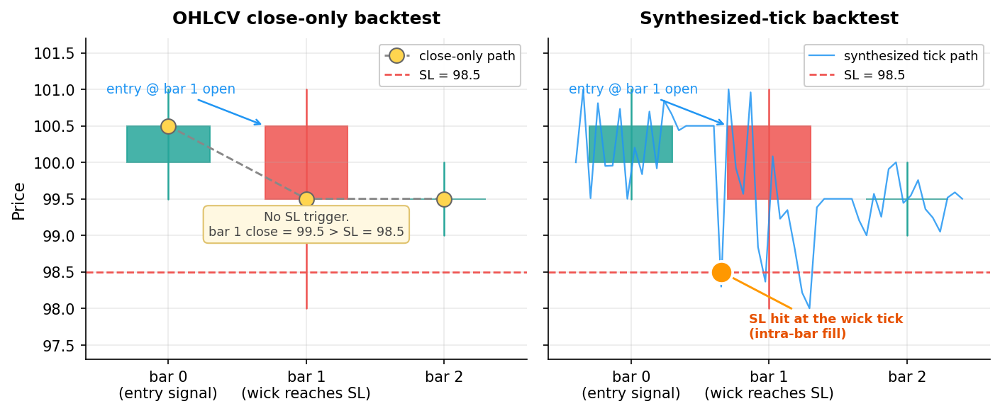

# TickWeaver

> A backtest engine for OHLCV-based trading strategies. Reconstructs intra-bar
> price paths as **synthesized ticks**, then runs your strategy on top of them.

[]()
[]()
[]()
[]()

---

Most simple OHLC backtests fill orders only at bar open or close. Tick-level
data is expensive or has short retention. TickWeaver bridges the gap by
**synthesizing a plausible intra-bar tick path from OHLC alone**, with strict
mathematical guarantees so it never contradicts the bar.



The figure shows the same three bars handled two ways. A bar whose wick
dips below an SL line while the close stays above never triggers the SL
in a close-only backtest (left). A synthesized-tick backtest follows a
plausible path through the bar's `(O, H, L, C)` and catches the SL at
the wick price (right).

## Key guarantees (the C1~C7 contract)

For every synthesized tick sequence on a bar `(O, H, L, C)`:

| # | Constraint | Meaning |
|---|---|---|
| C1 | `ticks[0] == O` | starts at bar open |
| C2 | `ticks[-1] == C` | ends at bar close |
| C3 | `min(ticks) == L` | bar low is hit |
| C4 | `max(ticks) == H` | bar high is hit |
| C5 | every `tick in [L, H]` | nothing escapes the bar |
| C6 | `n_min <= n <= n_max` | configurable count |
| C7 | same `(bar, n, seed)` -> bit-exact identical | deterministic |

Validated by `tick_synthesis/validator.py`. Fuzz-tested with **2380+ hypothesis
property cases**. Same suite must pass for any new generator.

## Quick start

```bash
# 1. Install (Python 3.11+)
python -m venv .venv && source .venv/bin/activate    # Linux/macOS
# .venv\Scripts\activate                              # Windows
pip install -r requirements-dev.txt
pip install -e .

# 2. Download data via CCXT public endpoint (no API key required)
python scripts/download_data.py --exchange binance --symbol "BTC/USDT:USDT" \
    --timeframe 1h --since 2024-01-01 --until 2024-07-01

# 3. Run a backtest. --strategy auto-resolves to strategies/<name>.py
python scripts/run_backtest.py --strategy rsi_mean_reversion

# 4. (optional) Add --viz to open an interactive chart after the run
pip install -r requirements-viz.txt
python scripts/run_backtest.py --strategy rsi_mean_reversion --viz
```

Open `reports/<strategy>_<UTC ts>/report.html` in a browser, or pass `--viz`
to inspect candles, fill markers, and trade pairs on an interactive chart.

## What you get

- **Six built-in streaming indicators**: `SMA`, `EMA`, `RSI`, `ATR`, `MACD`,
  `BollingerBands`. Common contract: `update / value / is_warm / reset`.
  Count-based (gap-safe), deterministic.
- **All four major order types**: `MARKET`, `LIMIT`, `STOP`, `STOP_LIMIT`.
  LIMIT fills as maker (no slippage). STOP triggers as taker. Lookahead
  protection: an order submitted in `on_bar` fills from the FIRST tick of
  the NEXT bar.
- **Two synthesis algorithms**: `uniform` (default, conservative) and
  `bridge` (log-space Brownian bridge, more natural intra-bar paths).
  Direct comparison is isolated to `compare_runs.py` only.
- **HTML report** per run: metrics, equity curve + drawdown, trades table,
  and a "Tick Synthesis (proof)" section showing seed and per-bar statistics.
- **Live `tqdm` progress** with rolling equity update; auto-disabled in
  non-tty (e.g. pytest, CI).
- **Strategy authoring**: a single `.py` file. Trading parameters are
  module constants inside the .py. The engine injects `api` and `context`
  into module globals. No json side-files — the yaml config under
  `configs/` defines the environment, the .py defines the strategy.
- **Optional chart visualization**: `--viz` opens a finplot window with
  candles, fill markers, trade pair lines, indicator sub-panels, and a
  docked position-history table (with per-cycle fees + CSV export). Price
  precision is derived per symbol from CCXT market info. Post-hoc only —
  does not affect backtest determinism.
- **Fill diagnostic tool**: `scripts/diagnose_fills.py` reports whether
  each fill landed at a bar boundary or inside a wick, so you can verify
  empirically that synthesized ticks are being exercised.

## Strategy file example

```python
# strategies/rsi_mean_reversion.py
from tickweaver.strategy.indicators import RSI

# Trading parameters live as module constants - edit here to tune.
RSI_PERIOD = 14
OVERSOLD = 30.0
OVERBOUGHT = 70.0
SIZE_PCT = 0.2

rsi = None

def on_init():
    global rsi
    rsi = RSI(period=RSI_PERIOD)

def on_bar(bar):
    rsi.update(bar.close)
    if not rsi.is_warm:
        return
    if rsi.value < OVERSOLD and api.is_flat():
        api.market_buy(api.size_from_cash_pct(SIZE_PCT, bar.close))
    elif rsi.value > OVERBOUGHT and not api.is_flat():
        api.close_position()
```

That's it. Run with:

```bash
python scripts/run_backtest.py --strategy rsi_mean_reversion
```

`--strategy` accepts any of these — all resolve to the same file:

```bash
--strategy rsi_mean_reversion
--strategy rsi_mean_reversion.py
--strategy strategies/rsi_mean_reversion.py
--strategy /abs/path/to/rsi_mean_reversion.py
```

See [`strategies/_reference.md`](strategies/_reference.md) for the full
API dictionary (signatures, types, patterns, pitfalls).

## Strategy patterns

TickWeaver strategies are file-based modules with five optional lifecycle
hooks: `on_init`, `on_bar`, `on_tick`, `on_fill`, `on_deinit`. The engine
calls each only if defined. Two patterns cover most use cases:

### Pattern 1 — `on_bar` only (signal on bar close)

Traditional indicator-based strategies where signals are evaluated when
each bar closes. Indicators update on `bar.close`, just like a live bot
that polls closed candles. Orders submitted in `on_bar` fill from the
first tick of the next bar, so every fill lands at a bar boundary.

Reference: [`strategies/rsi_mean_reversion.py`](strategies/rsi_mean_reversion.py)
— RSI < 30 entry, RSI > 70 exit.

### Pattern 2 — `on_bar` entry + `on_tick` exit (recommended for SL/TP)

Entry signal is decided on bar close; SL/TP are evaluated on **every
synthesized tick**, so exits can fire inside a bar's wick at the actual
price the wick reached — not at bar close. This is where the synthesized
tick path earns its keep.

Reference: [`strategies/ema_market_sl_tp.py`](strategies/ema_market_sl_tp.py)
— EMA(12/26) golden cross entry, on_tick SL (-1.0%) / TP (+1.5%) exit.

The diagnostic script below shows the difference empirically: Pattern-1
records 0% inside-wick fills, while Pattern-2 records a meaningful share
of fills landing throughout the wick.

## Visualization (optional)

Run any backtest with `--viz` to open an interactive chart after the run
completes. The chart is post-hoc — it does not interfere with backtest
decisions, so `--viz` on or off produces bit-exact same `final_equity`.

```bash
# 1. Install the optional viz extras (PyQt6 + pyqtgraph + finplot)
pip install -r requirements-viz.txt

# 2. Add --viz to any backtest
python scripts/run_backtest.py --strategy ema_market_sl_tp --viz
```

### What you see

- **Candlesticks** — bull green / bear soft red on a dark navy background.
- **Buy markers** — blue right-pointing triangles (`>`) at each entry fill.
- **Sell markers** — orange left-pointing triangles (`<`) at each exit fill.
- **Pair lines** — dashed blue lines connecting each entry to its exit,
  so round-trip P&L is visible at a glance.
- **Marker hover tooltips** — hover a fill marker to see its Order #, side,
  entry/exit price (at the symbol's price precision), and round-trip P&L.
- **Indicator sub-panels** — indicators bound to a non-price panel (e.g.
  `RSI`) render in their own panel, X-linked to and panning with the price.
- **Position history table** (docked below the chart) — one row per
  position open/close: `#`, Timestamp, Order #, Side, Margin, Entry Price,
  PnL, Cum. PnL, **Fee**, and **Cum. Fee** (open rows show their own entry
  fee; close rows the distributed exit fee). Toggle the optional
  `Holding Bars` column with the checkbox. **Right-click → "Export to
  CSV…"** saves the visible table (UTF-8, full-precision values).

Markers are aligned to the candle column they belong to. The y-coordinate
is the actual fill price, so when an exit happens inside a wick the marker
sits visibly within the wick — not at the bar's close. Entry Price and the
tooltip prices use the symbol's own decimal precision (e.g. binance
`BTC/USDT:USDT` shows 1 decimal), auto-detected from CCXT market info.

### Chart controls (finplot defaults)

| Action | Effect |
|---|---|
| Scroll wheel | Zoom in / out |
| Drag | Pan left / right |
| Double click | Fit view to data |

## Verification: did intra-bar fills actually happen?

A common question: "I'm using synthesized ticks, but are my fills really
landing inside bars, or are they all at bar boundaries?" Run the diagnostic:

```bash
python scripts/diagnose_fills.py ema_market_sl_tp
```

For each fill the script checks whether:
- the timestamp falls on a bar boundary (matches some bar's close timestamp),
- the price matches the next bar's open (typical for on_bar + market orders),
- the price lands strictly inside the bar's wick (open, close, and the L/H
  range are all checked).

Example summary output:

```
=== summary ===
  fill_ts == some bar boundary        : 139/276  ( 50.4%)
  fill_px ~= next_bar.open            : 155/276  ( 56.2%)
  fill_px strictly inside wick        : 103/276  ( 37.3%)
```

Pattern-1 strategies show 100% boundary fills — the synthesizer runs every
bar but the strategy has no way to consult sub-bar prices. Pattern-2
strategies show a meaningful `inside_wick` share — that percentage is the
synthesized tick path doing visible work in your fills.

Raw fill data is written to `reports/<strategy>_<UTC ts>/fills.csv` with
nanosecond-precision timestamps preserved, so you can also open it in
Excel or pandas to inspect exactly when in a 1-hour bar a tick-level exit
was triggered.

## Architecture (current scope)

```
CCXT OHLCV download
  -> normalize (standard schema, P4)
  -> ReplayFeed (BarEvent stream)
  -> tick_synthesis (uniform | bridge, C1~C7)
  -> BacktestEngine
       -> strategy.on_tick / on_bar
       -> BacktestBroker (MARKET / LIMIT / STOP / STOP_LIMIT)
  -> analytics
       -> equity.parquet, trades.parquet, fills.csv, metrics.json
       -> equity_curve.png, sample_tick_paths.png
       -> report.html
  -> (optional) viz.LiveChartHook
       -> finplot replay window (V2 determinism preserved)
```

## Documentation

- [`docs/backtest_quickstart.md`](docs/backtest_quickstart.md) — first
  backtest in 30 minutes
- [`docs/strategy_authoring.md`](docs/strategy_authoring.md) — pattern
  catalog and pitfalls
- [`docs/USER_GUIDE.md`](docs/USER_GUIDE.md) — end-to-end workflow,
  result interpretation, troubleshooting
- [`docs/DEVELOPER_GUIDE.md`](docs/DEVELOPER_GUIDE.md) — architecture,
  six extension scenarios, testing, debugging, release
- [`strategies/_reference.md`](strategies/_reference.md) — strategy
  API reference

## Current status

- **M0~M4 and M6 complete.** 92 tests passing (including 2380+ hypothesis
  property cases for the C1~C7 contract).
- **M5 (live trading) archived** to `_archive_live/` per decision D11.
  Restorable later.
- Current data source is **CCXT only** (D10). External OHLCV loaders
  (CSV / Binance ZIP) are frozen as future work.

## Locked decisions (excerpt)

| ID | Decision |
|---|---|
| D2 | USDT-M Perpetual (futures) is the primary market type |
| D8 | File-based strategy authoring (MT4 EA style) + JSON pairing |
| D10 | Current data source = CCXT only |
| D11 | Backtest only; live archived to `_archive_live/` |
| D12 | Synthetic tick precision = methodology, not a goal in itself |
| D13 | Missing OHLCV bars: skip-only (no interpolation, no fail) |
| D14 | Single-threaded execution |
| D15 | No API key required at any stage; `.env` not used |
| D16 | uniform vs bridge comparison is `compare_runs.py` only |
| D17 | `run_backtest.py` requires only `--strategy`; auto-resolves the path |

## Why "synthetic tick"?

Synthesizing intra-bar ticks is a **methodology to narrow the gap between
backtest and forward test**, not an end in itself (D12). It does not claim
to recover the true microstructure — it gives strategies a plausible path
that respects the bar's H/L/O/C. Pair it with conservative slippage and
fee models and treat the results as one estimate among several.

## Contributing

PRs welcome — please read [`docs/DEVELOPER_GUIDE.md`](docs/DEVELOPER_GUIDE.md)
first. Adding a new tick generator, indicator, or fee/slippage model is
covered there as worked examples.

When opening a PR:
- run `pytest --hypothesis-show-statistics` and ensure all 92+ tests pass
- keep new modules import-clean (no circular imports across layers)
