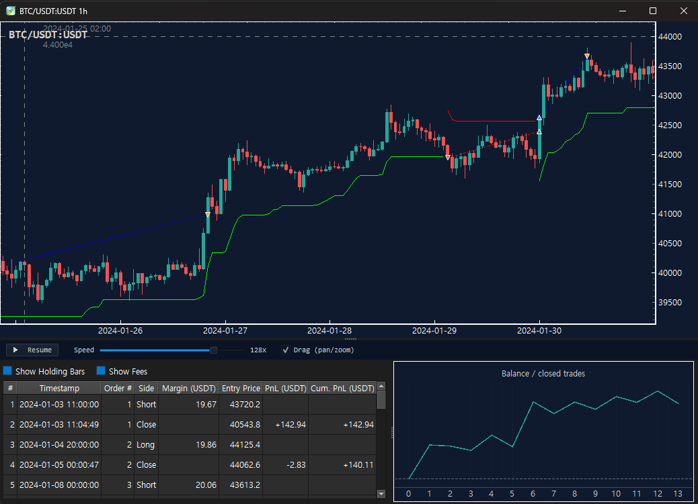

# TickWeaver

> A backtest engine for OHLCV-based trading strategies. Reconstructs intra-bar
> price paths as **synthesized ticks**, then runs your strategy on top of them.

[]()
[]()
[]()
[]()

---

Most simple OHLC backtests fill orders only at bar open or close. Tick-level
data is expensive or has short retention. TickWeaver bridges the gap by
**synthesizing a plausible intra-bar tick path from OHLC alone**, with strict
mathematical guarantees so it never contradicts the bar.


The figure shows the same three bars handled two ways. A bar whose wick
dips below an SL line while the close stays above never triggers the SL
in a close-only backtest (left). A synthesized-tick backtest follows a
plausible path through the bar's `(O, H, L, C)` and catches the SL at
the wick price (right).

## Key guarantees (the C1~C7 contract)

For every synthesized tick sequence on a bar `(O, H, L, C)`:

| # | Constraint | Meaning |
|---|---|---|
| C1 | `ticks[0] == O` | starts at bar open |
| C2 | `ticks[-1] == C` | ends at bar close |
| C3 | `min(ticks) == L` | bar low is hit |
| C4 | `max(ticks) == H` | bar high is hit |
| C5 | every `tick in [L, H]` | nothing escapes the bar |
| C6 | `n_min <= n <= n_max` | configurable count |
| C7 | same `(bar, n, seed)` -> bit-exact identical | deterministic |

Validated by `tick_synthesis/validator.py`. Fuzz-tested with **2380+ hypothesis
property cases**. Same suite must pass for any new generator.

## Quick start

```bash
# 1. Install (Python 3.11+)
python -m venv .venv && source .venv/bin/activate    # Linux/macOS
# .venv\Scripts\activate                              # Windows
pip install -r requirements-dev.txt
pip install -e .

# 2. Download data via CCXT public endpoint (no API key required)
python scripts/download_data.py --exchange binance --symbol "BTC/USDT:USDT" \
    --timeframe 1h --since 2024-01-01 --until 2024-07-01

# 3. Run the bundled example strategy. `supertrend` ships in strategies/;
#    --strategy auto-resolves to strategies/<name>.py. It takes both long
#    and short trades, so it needs a futures config (configs/futures.yaml).
python scripts/run_backtest.py --strategy supertrend --config futures.yaml

# 4. (optional) Add --viz to open an interactive chart after the run
pip install -r requirements-viz.txt
python scripts/run_backtest.py --strategy supertrend --config futures.yaml --viz
```

Open `reports/<strategy>_<UTC ts>/report.html` in a browser, or pass `--viz`
to inspect candles, fill markers, and trade pairs on an interactive chart.

## What you get

- **Ten built-in streaming indicators**: `SMA`, `EMA`, `RSI`, `ATR`,
  `SuperTrend`, `MACD`, `BollingerBands`, `Stochastic`, `Pivot`, `HARSI`.
  Common contract: `update / value / is_warm / reset`.
  Count-based (gap-safe), deterministic.
- **All four major order types**: `MARKET`, `LIMIT`, `STOP`, `STOP_LIMIT`.
  LIMIT fills as maker (no slippage). STOP triggers as taker. Lookahead
  protection: an order submitted in `on_bar` fills from the FIRST tick of
  the NEXT bar.
- **Two synthesis algorithms**: `uniform` (default, conservative) and
  `bridge` (log-space Brownian bridge, more natural intra-bar paths).
  Direct comparison is isolated to `compare_runs.py` only.
- **HTML report** per run: metrics, equity curve + drawdown, trades table,
  and a "Tick Synthesis (proof)" section showing seed and per-bar statistics.
- **Live `tqdm` progress** with rolling equity update; auto-disabled in
  non-tty (e.g. pytest, CI).
- **Strategy authoring**: a single `.py` file. Trading parameters are
  module constants inside the .py. The engine injects `api` and `context`
  into module globals. No json side-files — the yaml config under
  `configs/` defines the environment, the .py defines the strategy.
- **Optional chart visualization**: `--viz` opens a finplot window with
  candles, fill markers, trade pair lines, indicator sub-panels, and a
  docked position-history table (with per-cycle fees + CSV export). Price
  precision is derived per symbol from CCXT market info. Post-hoc only —
  does not affect backtest determinism.
- **Fill diagnostic tool**: `scripts/diagnose_fills.py` reports whether
  each fill landed at a bar boundary or inside a wick, so you can verify
  empirically that synthesized ticks are being exercised.

## Strategy file example

The bundled `supertrend` strategy is the canonical example (full code in
[`strategies/supertrend.py`](strategies/supertrend.py)). It's a **Pattern 2**
strategy — entry decided on bar close, exit managed on every synthesized tick —
which is exactly where the tick path earns its keep. Trading parameters live as
module constants at the top of the file:

```python
# strategies/supertrend.py  (excerpt — see the file for the full pivot / SL / TP logic)
from tickweaver.strategy.indicators import SuperTrend

# Trading parameters live as module constants - edit here to tune.
ST_PERIOD = 10          # SuperTrend ATR length
ST_MULT = 3.0           # SuperTrend ATR multiplier
SWING_LOOKBACK = 2      # bars each side to confirm a swing low/high (the stop)
TP_R = 1.5              # take-profit = TP_R * risk (entry-to-SL distance)
SIZE_PCT = 0.2          # 20% of available cash per entry

def on_bar(bar):
    st.update_bar(bar)              # SuperTrend + swing-pivot tracking
    if not st.is_warm or not api.is_flat():
        return
    # SuperTrend flips bearish->bullish => go Long  (SL = last swing low).
    # flips bullish->bearish => go Short (futures only, SL = last swing high).
    if buy_flip:
        api.market_buy(api.size_from_cash_pct(SIZE_PCT, bar.close))

def on_tick(tick):
    # SL/TP enforced on every synthesized tick — the exit fires inside the
    # wick at the price the wick actually reached, not at bar close.
    if not api.is_flat() and (tick.price <= sl_price or tick.price >= tp_price):
        api.close_position()
```

SuperTrend takes both long and short trades, so it needs a **futures** config
(`configs/futures.yaml` — the default `configs/default.yaml` is spot and would
reject the shorts). Run it with:

```bash
python scripts/run_backtest.py --strategy supertrend --config futures.yaml
```

`--strategy` accepts any of these — all resolve to the same file:

```bash
--strategy supertrend
--strategy supertrend.py
--strategy strategies/supertrend.py
--strategy /abs/path/to/supertrend.py
```

See [`strategies/_reference.md`](strategies/_reference.md) for the full
API dictionary (signatures, types, patterns, pitfalls).

## Strategy patterns

TickWeaver strategies are file-based modules with five optional lifecycle
hooks: `on_init`, `on_bar`, `on_tick`, `on_fill`, `on_deinit`. The engine
calls each only if defined. Two patterns cover most use cases:

### Pattern 1 — `on_bar` only (signal on bar close)

Traditional indicator-based strategies where signals are evaluated when
each bar closes. Indicators update on `bar.close`, just like a live bot
that polls closed candles. Orders submitted in `on_bar` fill from the
first tick of the next bar, so every fill lands at a bar boundary.

For example, an RSI strategy that enters when RSI < 30 and exits when
RSI > 70 — signal computed on bar close, fills at the next bar boundary.

### Pattern 2 — `on_bar` entry + `on_tick` exit (recommended for SL/TP)

Entry signal is decided on bar close; SL/TP are evaluated on **every
synthesized tick**, so exits can fire inside a bar's wick at the actual
price the wick reached — not at bar close. This is where the synthesized
tick path earns its keep.

The bundled `supertrend` strategy is exactly this: a SuperTrend-flip entry
decided on bar close, with a swing-based stop-loss and 1.5R take-profit
evaluated on every synthesized tick — the exit fires inside the wick at the
price the wick actually reached.

The diagnostic script below shows the difference empirically: Pattern-1
records 0% inside-wick fills, while Pattern-2 records a meaningful share
of fills landing throughout the wick.

## Visualization (optional)

Run any backtest with `--viz` to open an interactive chart after the run
completes. The chart is post-hoc — it does not interfere with backtest
decisions, so `--viz` on or off produces bit-exact same `final_equity`.

```bash
# 1. Install the optional viz extras (PyQt6 + pyqtgraph + finplot)
pip install -r requirements-viz.txt

# 2. Add --viz to any backtest
python scripts/run_backtest.py --strategy supertrend --config futures.yaml --viz
```

The window shows the candles with fill markers, entry→exit pair lines, any
indicator sub-panels, and a docked position-history table.

### Interacting with the chart

- **Indicator panels** — bind an indicator from your strategy with
  `api.bind_indicator("RSI", rsi)`. One whose `PANEL` is not `"price"` (e.g.
  `RSI`) opens its own sub-panel, X-linked to and panning with the price;
  `"price"` indicators overlay on the candles.
- **Position table columns** — toggle the **Show Fees** (Fee / Cum. Fee) and
  **Show Holding Bars** columns with the checkboxes above the table.
- **Export to CSV** — right-click the position table → **Export to CSV…** to
  save the currently visible columns (UTF-8, full-precision values).
- **Marker / curve hover** — hover a fill marker (or a balance-curve point in
  streaming mode) for a tooltip with the trade details.

### Chart controls (finplot defaults)

| Action | Effect |
|---|---|
| Scroll wheel | Zoom in / out |
| Drag | Pan left / right |
| Double click | Fit view to data |

### Streaming replay (`--viz --stream`)

Add `--stream` to `--viz` to **replay the backtest as a live animation**
instead of drawing everything at once. Each candle grows from its open tick
by tick — the body extends, the wicks trail, and the colour flips bull / bear
by current-price-vs-open — then closes and the next bar begins. Fill markers,
trade pair lines, indicator sub-panels, the position table, and a realized
**balance curve** all update in step with the replay. It stays post-hoc and
deterministic: `--stream` does not change `final_equity`.

```bash
python scripts/run_backtest.py --strategy supertrend --config futures.yaml --viz --stream
```

**Playback controls** (bottom bar):

| Control | Effect |
|---|---|
| **Pause / Resume** | Freeze / resume tick consumption. When the replay ends the button becomes **↻ Replay** — click to replay from the start. |
| **Speed slider** | Ticks consumed per frame: `1x · 2x · 8x · 64x · 128x · 256x` (default `128x`). Low = watch a single candle form; high = replay a long run quickly. |
| **Drag toggle** | **OFF** (default): the view auto-follows the forming candle and auto-rescales Y so a tall bar stays framed. **ON**: free pan / wheel-zoom, with Y still auto-fitting to the candles in view. |

**Live elements**

- **Candle animation** — open → growing body → wick trail → close → next bar,
  recoloured bull / bear by current price vs open.
- **Fill markers & pair lines** — each entry / exit marker and its dashed
  connecting line appear at the moment the close arrow does.
- **Indicator sub-panels** — reveal bar by bar as the replay reaches them.
- **Position history table** — rows appear as trades close. Toggle the
  **Show Fees** and **Show Holding Bars** columns with the checkboxes; drag the
  handle between the table and the balance curve to set their width split.
- **Balance curve** — realized account balance after each closed trade
  (X = close count, starting at initial capital). Hover any point for a tooltip
  with the trade number, date, balance, and that trade's PnL.

<!-- IMAGE PLACEHOLDER (window layout) — drop the screenshot at docs/img/streaming_layout.png -->


## Verification: did intra-bar fills actually happen?

A common question: "I'm using synthesized ticks, but are my fills really
landing inside bars, or are they all at bar boundaries?" Run the diagnostic:

```bash
python scripts/diagnose_fills.py supertrend
```

For each fill the script checks whether:
- the timestamp falls on a bar boundary (matches some bar's close timestamp),
- the price matches the next bar's open (typical for on_bar + market orders),
- the price lands strictly inside the bar's wick (open, close, and the L/H
  range are all checked).

Example summary output:

```
=== summary ===
  fill_ts == some bar boundary        : 139/276  ( 50.4%)
  fill_px ~= next_bar.open            : 155/276  ( 56.2%)
  fill_px strictly inside wick        : 103/276  ( 37.3%)
```

Pattern-1 strategies show 100% boundary fills — the synthesizer runs every
bar but the strategy has no way to consult sub-bar prices. Pattern-2
strategies show a meaningful `inside_wick` share — that percentage is the
synthesized tick path doing visible work in your fills.

Raw fill data is written to `reports/<strategy>_<UTC ts>/fills.csv` with
nanosecond-precision timestamps preserved, so you can also open it in
Excel or pandas to inspect exactly when in a 1-hour bar a tick-level exit
was triggered.

## Architecture (current scope)

```
CCXT OHLCV download
  -> normalize (standard schema, P4)
  -> ReplayFeed (BarEvent stream)
  -> tick_synthesis (uniform | bridge, C1~C7)
  -> BacktestEngine
       -> strategy.on_tick / on_bar
       -> BacktestBroker (MARKET / LIMIT / STOP / STOP_LIMIT)
  -> analytics
       -> equity.parquet, trades.parquet, fills.csv, metrics.json
       -> equity_curve.png, sample_tick_paths.png
       -> report.html
  -> (optional) viz.LiveChartHook / StreamingChartHook
       -> finplot replay window — static (--viz) or live streaming
          (--viz --stream); V2 determinism preserved
```

## Documentation

- [`docs/backtest_quickstart.md`](docs/backtest_quickstart.md) — first
  backtest in 30 minutes
- [`docs/strategy_authoring.md`](docs/strategy_authoring.md) — pattern
  catalog and pitfalls
- [`docs/USER_GUIDE.md`](docs/USER_GUIDE.md) — end-to-end workflow,
  result interpretation, troubleshooting
- [`docs/DEVELOPER_GUIDE.md`](docs/DEVELOPER_GUIDE.md) — architecture,
  six extension scenarios, testing, debugging, release
- [`strategies/_reference.md`](strategies/_reference.md) — strategy
  API reference

## Current status

- **M0~M4 and M6 complete.** 466 tests passing (including 2380+ hypothesis
  property cases for the C1~C7 contract).
- **Backtest only (D11).** Live trading is out of scope; the M5 live-trading
  code is not part of this repository.
- Current data source is **CCXT only** (D10). External OHLCV loaders
  (CSV / Binance ZIP) are frozen as future work.

## Validation: cross-checked against TradingView

TickWeaver's engine has been cross-checked against TradingView's PineScript backtester on the same OKX `BTCUSDT.P` 1h data (~5 months, 0% commission):

| Strategy | Trades (TW vs TV) | Agreement | Residual cause |
|---|---|---|---|
| EMA cross (bar-close signal) | 65 vs 66 (±1) | return within 0.30%p | EMA warmup seeding |
| SuperTrend (intra-bar SL/TP) | 40 vs 40 | final equity within ~1% | synthesized intra-bar tick path |

Aggregate metrics agree within ~1% of account value and ±1 trade. Residual differences trace to **known, documented causes** — indicator warmup seeding and TickWeaver's synthesized intra-bar tick path (an *intentional* enhancement over naive OHLC fills, not a discrepancy). A bar-resolution mode (the `ohlc` tick generator) reproduces TradingView's OHLC fill model to within **0.82%** of final equity.

### Quantitative similarity to TradingView

Per-metric agreement, defined as `100% × (1 − |TickWeaver − TradingView| / |TradingView|)`:

| Metric | EMA Cross | SuperTrend |
|---|---:|---:|
| Trade count | 65 vs 66 → **98.5%** | 40 vs 40 → **100%** |
| Final account value | 9,800.23 vs 9,830.02 → **99.7%** | 10,473.09 vs 10,596.60 → **98.8%** |
| Win rate | 23.08% vs 24.24% → **95.2%** | 57.5% vs 57.5% → **100%** |
| Profit factor | 0.733 vs 0.827 → **88.6%** | 1.752 vs 1.699 → **96.9%** |

**~99% agreement on final account value** (EMA 99.7%, SuperTrend 98.8% — the bar-resolution `ohlc` mode raises SuperTrend to **99.2%**), with trade count exact (SuperTrend) or within one (EMA) and win rate matched exactly on SuperTrend. EMA Cross is a near-breakeven strategy, so its ratio metrics (win rate, profit factor) are more sensitive to a single-trade difference — final account value is the most representative similarity measure.

This is a focused validation (two strategies, one dataset), not a universal guarantee. Full method, configs, PineScript, and reproducible results are in [`parity/`](parity/) (see [`parity/GUIDELINE.md`](parity/GUIDELINE.md) and [`parity/RESULTS.md`](parity/RESULTS.md)).

## Locked decisions (excerpt)

| ID | Decision |
|---|---|
| D2 | USDT-M Perpetual (futures) is the primary market type |
| D8 | File-based strategy authoring (MT4 EA style); no JSON side-files |
| D10 | Current data source = CCXT only |
| D11 | Backtest only; live trading out of scope (not in this repo) |
| D12 | Synthetic tick precision = methodology, not a goal in itself |
| D13 | Missing OHLCV bars: skip-only (no interpolation, no fail) |
| D14 | Single-threaded execution |
| D15 | No API key required at any stage; `.env` not used |
| D16 | uniform vs bridge comparison is `compare_runs.py` only |
| D17 | `run_backtest.py` requires only `--strategy`; auto-resolves the path |

## Why "synthetic tick"?

Synthesizing intra-bar ticks is a **methodology to narrow the gap between
backtest and forward test**, not an end in itself (D12). It does not claim
to recover the true microstructure — it gives strategies a plausible path
that respects the bar's H/L/O/C. Pair it with conservative slippage and
fee models and treat the results as one estimate among several.

## Contributing

PRs welcome — please read [`docs/DEVELOPER_GUIDE.md`](docs/DEVELOPER_GUIDE.md)
first. Adding a new tick generator, indicator, or fee/slippage model is
covered there as worked examples.

When opening a PR:
- run `pytest --hypothesis-show-statistics` and ensure all 466 tests pass
- keep new modules import-clean (no circular imports across layers)
